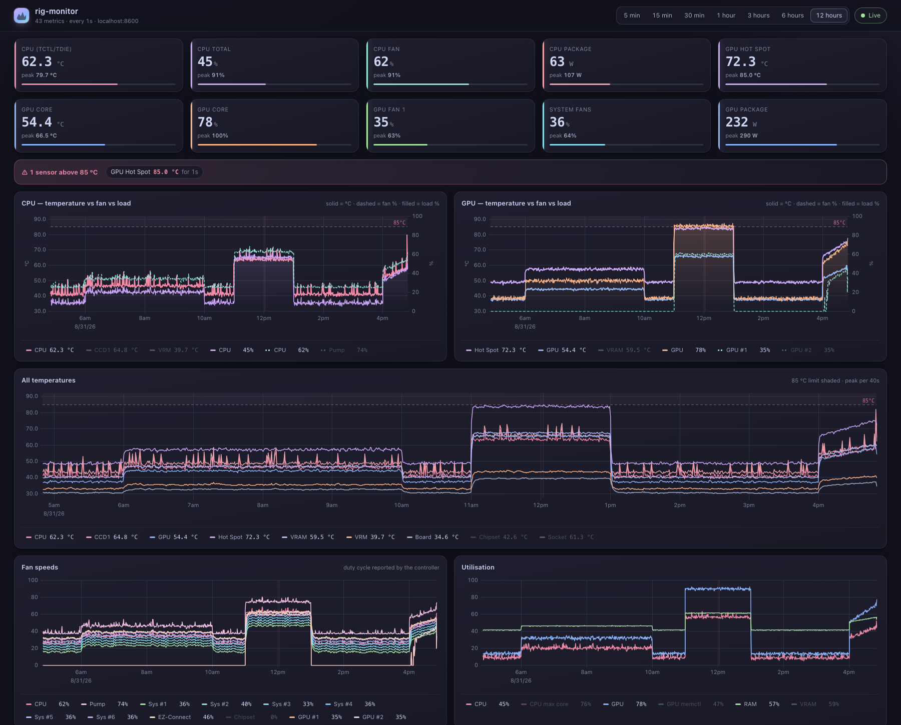
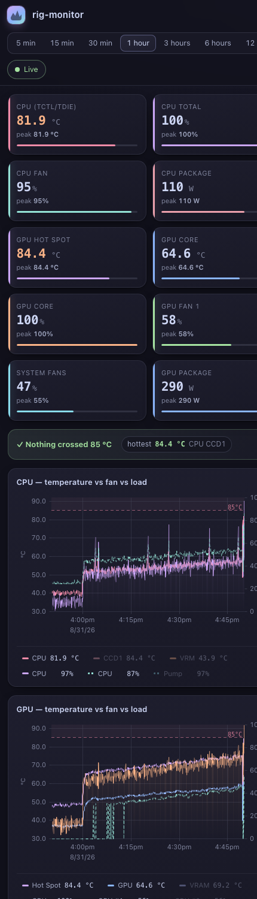

# rig-monitor

A small always-on recorder and web dashboard for a Windows gaming PC. It polls
LibreHardwareMonitor, keeps the history in SQLite, and serves a dark, chart-heavy
dashboard to any device on your LAN — so the graphs are already full of data the moment
you open it, and you can answer "did anything go over 85 °C, and what were the fans doing
at the time?" without re-running a benchmark.



Built for: Ryzen 7 7800X3D · RTX 4070 Ti SUPER ROG Strix · Nuvoton NCT6687D board sensors.
Other hardware works too — sensors are matched by name, not by index.

## What it shows

- **CPU** and **GPU** overlays that put temperature, fan duty and utilisation on one
  time axis with a shared cursor, which is the view that actually answers "are the fans
  keeping up with the load?"
- **All temperatures**: CPU Tctl/Tdie, CCD1, GPU core, **GPU hot spot**, GPU memory
  junction, VRM MOS, motherboard, chipset — with the 85 °C limit drawn in and every
  excursion shaded across *all* charts, so you can see the fan response to each one.
- **Fan speeds** as % duty for the CPU fan, pump, all six system fan headers, EZ-Connect
  and both GPU fans, plus a separate RPM chart for spotting a stalled fan.
- **Utilisation** (CPU, GPU, GPU memory controller, RAM, VRAM) and **power draw**.
- A summary strip that names every sensor that crossed 85 °C in the visible window, how
  long it stayed there and how many separate episodes there were.

Ranges run from 5 minutes to 12 hours. Sensors are sampled once a second, and the
readouts refresh at that rate; the charts redraw as often as a new point can actually
appear (every second on the 5- and 15-minute views, backing off to 15 s on the 12-hour
view, where a single point already covers 40 s). Drag on any chart to zoom into a window;
click a legend entry to hide a series (both are remembered). `?range=12h` in the URL is
bookmarkable, which is convenient on a phone.

## Requirements

- **LibreHardwareMonitor** running **as administrator** with
  *Options → Remote Web Server → Run* enabled (default port 8085).
  Without administrator rights it will not report CPU temperature or fan control values.
  RAM utilisation additionally needs the *Memory* hardware group enabled — it is off on
  this rig, so `ram.load` is the one catalogue metric that currently finds no sensor.
  Everything else binds automatically.
- **Python 3.11+** on the Windows PC. No third-party packages — everything uses the
  standard library, and uPlot is vendored in `web/vendor/`.

## Install on the target PC

Copy this folder to the PC, then from an **elevated** PowerShell in the project folder:

```powershell
powershell -ExecutionPolicy Bypass -File .\install-windows.ps1
```

That verifies the sensor source, registers a hidden scheduled task that starts the
collector at logon, and opens TCP 8600 to your local subnet only. Adjust with
`-Port`, `-Subnet 192.168.0.0/24`, or tear it all down again with `-Uninstall`.

Then open:

| From | URL |
| --- | --- |
| the PC itself | `http://localhost:8600/` |
| any LAN client or Android phone | `http://192.168.0.110:8600/` |

To run it in a visible console instead (handy the first time): `.\run.ps1`.

## Backfilling your existing logs

If you already have LibreHardwareMonitor CSV logs, import them so the long ranges are
populated from day one. The log's header row carries sensor ids, so columns map onto the
same metric keys the live collector uses:

```powershell
python -m rigmon import "C:\path\to\LibreHardwareMonitorLogs"
```

Directories are scanned recursively, imported files are fingerprinted so re-running is a
no-op, and rows are folded straight into the 1-minute rollups.

## Commands

| Command | What it does |
| --- | --- |
| `python -m rigmon serve` | Run the collector and dashboard (default) |
| `python -m rigmon check` | Verify the data source, print a live snapshot and the history span |
| `python -m rigmon discover` | List every sensor LibreHardwareMonitor exposes and which metric it mapped to |
| `python -m rigmon import <paths>` | Backfill from CSV logs |

`serve` accepts `--port`, `--host`, `--lhm-url` and `--interval` overrides.

## Configuration

Copy `config.example.json` to `config.json` to change anything:

| Key | Default | Notes |
| --- | --- | --- |
| `lhm_url` | `http://127.0.0.1:8085/data.json` | Data source |
| `poll_interval` | `1` | Seconds between samples |
| `listen_port` | `8600` | Dashboard port |
| `raw_retention_days` | `1` | Full-resolution history (only has to outlive the 12 h range) |
| `rollup_retention_days` | `30` | 1-minute average/min/max history |
| `temp_alert_c` | `85` | The line drawn on the charts and used by the summary |
| `collect_all` | `false` | Record every sensor, not just the curated set |
| `extra_metrics` | `{}` | `{"ssd.temp": "/nvme/0/temperature/0"}` to add individual sensors |

Run `python -m rigmon discover` to find the sensor id for anything you want to add.

## How the data is kept

Every poll writes one row per metric to `sample`. Each completed minute is folded into
`sample_1m` as sum/count/min/max, and that table is what the longer ranges are drawn
from, so a 12-hour view is as cheap to render as a 5-minute one. Raw rows are dropped
after `raw_retention_days`, rollups after `rollup_retention_days`.

Temperatures are plotted as the **peak** of each bucket rather than the mean, so a brief
spike over 85 °C is never averaged away when you zoom out; everything else is plotted as
the mean. The chart hint tells you the bucket size in use.

At 1-second sampling, 42 metrics cost about **77 MB per day** of raw samples and 1.8 MB
per day of rollups, so the defaults settle at roughly **130 MB** on disk. Raising
`poll_interval` to 2 halves the raw half of that.

Rollups are kept for 30 days even though the UI only reaches back 12 hours, so the
history survives a change of mind about the range list — and `/api/summary?from=…&to=…`
can still answer "did anything cross 85 °C last week".

If LibreHardwareMonitor restarts or stops, the collector keeps retrying with a backoff,
the dashboard header says the source is unreachable, and the gap shows as a break in the
lines rather than a flat fake value.

## Security

The HTTP API is read-only and unauthenticated. The installer scopes the firewall rule to
your private subnet on private network profiles — keep it that way, and don't forward the
port through your router.

## Development

Nothing here needs the real hardware:

```bash
python tools/fake_lhm.py --port 8085 --speed 30   # simulated 7800X3D + 4070 Ti SUPER
python tools/seed_demo.py --hours 30              # plausible history to draw
python -m rigmon serve --port 8600
python -m unittest discover -s tests -t .
```

`tools/fake_lhm.py --locale pt` emits comma decimal separators to exercise the
locale-sniffing value parser, since LibreHardwareMonitor formats numbers using the
machine's locale.


